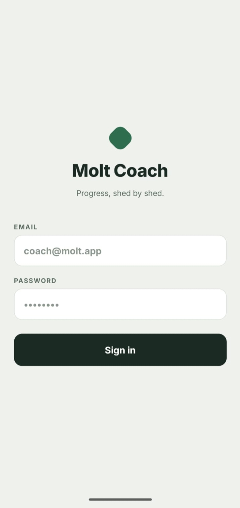
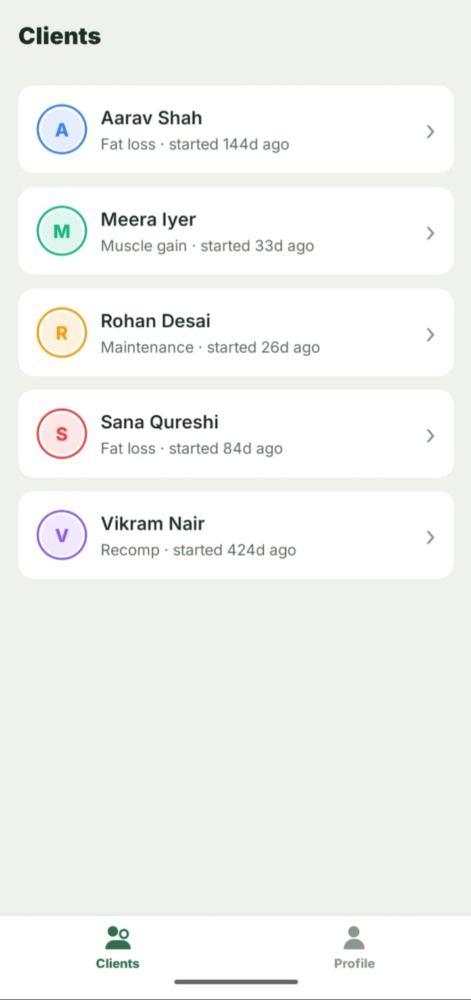
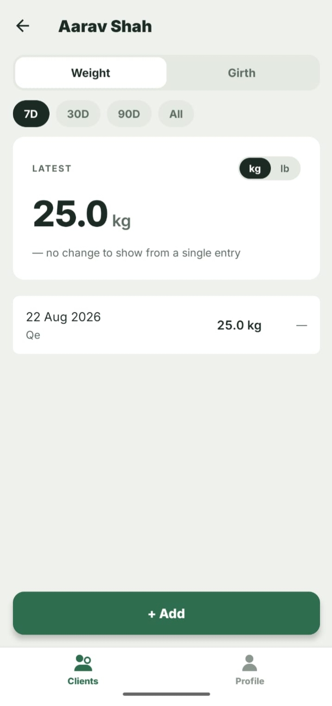
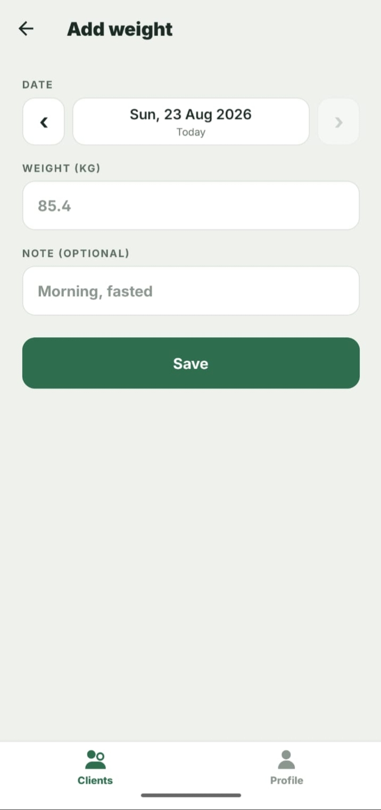
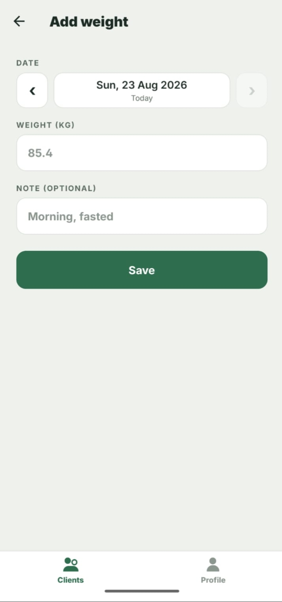
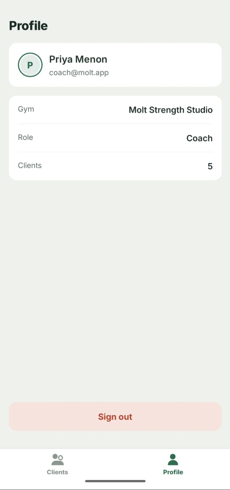

# Molt Coach

A React Native (CLI, TypeScript) app for a fitness coach: sign in, browse
clients, review weight and girth progress, add and delete weight entries —
built against the deliberately unreliable mock server in `task-files/`.

## Screenshots

| 1. Login | 2. Clients List | 3. Client Progress |
| :---: | :---: | :---: |
|  |  |  |

| 4. Add Weight Entry | 5. Weight Entry Screen | 6. Coach Profile |
| :---: | :---: | :---: |
|  |  |  |

## How to run

Prerequisites: Node ≥ 20, an Android emulator (or the iOS simulator on macOS).

```bash
# 1. Install dependencies
npm install

# 2. Start the mock server — leave it running
cd task-files/task-files
node server.js

# 3. In another terminal, start Metro
npm start

# 4. In a third terminal, build and launch the app
npm run adb:reverse  # Android: tunnel device port 4000 to the host (once per connection)
npm run android      # or: npm run ios
```

Test login: `coach@molt.app` / `molt1234`.

The app targets `http://localhost:4000` (see `src/api/client.ts`). On Android
— USB device or emulator — `npm run adb:reverse` makes the device's
localhost:4000 reach the mock server on your computer. Re-run it after
reconnecting the device.

Tests and checks:

```bash
npm test         # unit tests (conversions, delta calculations) + render test
npm run lint
npx tsc --noEmit
```